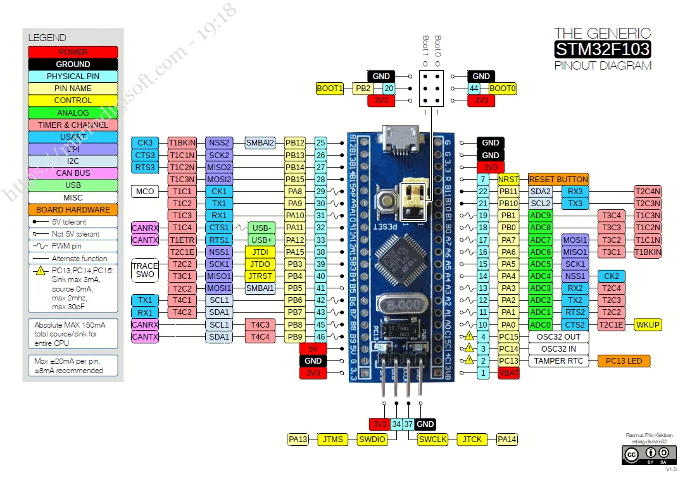
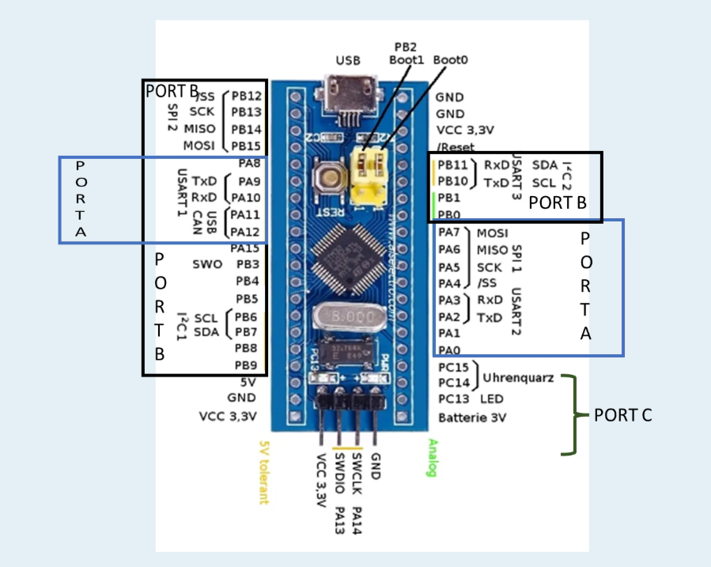
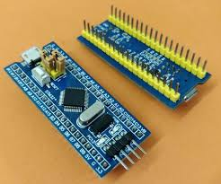
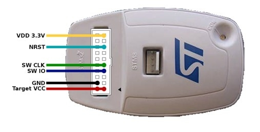

# Introduction to STM32 & Blue Pill Basics (STM32F103C8T6)

This introductory section is dedicated to covering the fundamental concepts and hardware knowledge necessary to begin bare-metal and HAL programming on the **STM32F103C8T6 (Blue Pill)** development board.

Understanding these concepts is crucial before diving into peripheral configuration and coding.

## Learning Objectives

* Understand the naming convention and core specifications of the STM32F103C8T6 MCU.
* Identify the main components on the Blue Pill board and their functions (e.g., PC13 LED, BOOT jumpers).
* Grasp the chip's pin naming convention and key non-GPIO pins.
* Understand the role of STM32CubeMX and the HAL Libraries.

---

## The Chip

The core of our development board is the **STM32F103C8T6** microcontroller, based on the **ARM Cortex-M3** core. It is a 32-bit RISC processor known for its balance of performance and energy efficiency, making it highly popular among hobbyists and professionals.

Here is its specs:

### MCU Naming Convention Breakdown
| Part | Value | Meaning |
| :---: | :---: | :--- |
| **STM** | | Manufacturer (STMicroelectronics) |
| **32** | | 32-bit architecture |
| **F1** | **F1** Series | General Purpose (Mainstream) |
| **03** | **03** Connectivity | Includes USB and CAN peripherals |
| **C** | **C** | 48-pin package |
| **8** | **8** | Flash memory size (64 KB) |
| **T** | **T** | Package type (LQFP) |
| **6** | **6** | Operating temperature range (-40°C to +85°C) |

---

## Pin Naming Convention

Now let's take a look at the pinout of this chip, taken from the datasheet:

### General Purpose Input/Output (GPIO) Overview

This section covers the fundamental role of GPIO pins in microcontrollers, their functionality, common uses, and the specific organization on the STM32F103C8T6 (Blue Pill) board.

## What is GPIO?

**GPIO (General Purpose Input/Output)** pins serve as the primary interface between the microcontroller (MCU) and the external world. They are versatile pins found on integrated circuits and circuit boards that can be used for various tasks, such as reading or sending digital signals. They make it possible to interact with sensors, actuators, and communication protocols.

The core functionality of a GPIO pin—whether it acts as an **input** (reading data) or an **output** (sending data)—is controlled entirely by **software**. A key feature of GPIO is the ability to dynamically change its function while the program is running by adjusting specific configuration settings (registers) within the MCU.

### Common Uses for GPIO Pins:

* **Reading** digital or analog values from external sensors.
* **Controlling** simple output devices (e.g., turning on/off LEDs, relays, motors).
* **Communicating** with other devices using single-wire protocols.
* **Handling Interrupts** (signals that require immediate, non-blocking attention from the CPU).

---

##  GPIO Pin Modes

The flexibility of STM32 GPIO pins comes from their ability to be configured into different operational modes via internal registers:

| Mode | Description | Common Use Cases |
| :---: | :--- | :--- |
| **Input** | Reads the logic level (high/low) from an external source. | Buttons, sensors, external signals |
| **Output** | Drives the pin high (VDD) or low (GND). | LEDs, relays, motor drivers, external devices |
| **Alternate Function** | Connects the pin to an on-chip peripheral (UART, SPI, I²C, etc.). | Communication interfaces, PWM, timers |
| **Analog** | Enables the pin for analog signals (ADC or DAC). | Analog sensors, voltage outputs |
| **Interrupt** | Triggers an event on signal transition (rising/falling edge). | Button presses, external event detection |

### Supplementary Pin Configurations

| Configuration | Description | Common Use Cases |
| :---: | :--- | :--- |
| **Pull-up/Pull-down** | Internal resistors to set default high/low when input is floating. | Pull-up for buttons, pull-down for inputs |
| **Open-drain** | Can only pull low; requires an external resistor to pull high. | I²C communication, multiple devices sharing a signal line |

---

##  Commonly Used GPIO Pins on Blue Pill (STM32F103C8T6)

Understanding which pins are multiplexed with common peripherals is critical for development:

| Pin(s) | Function | Notes |
| :---: | :--- | :--- |
| **PC13** | **Onboard LED** | Typically connected to the onboard user LED (Active-Low). |
| **PA0** | **ADC Channel** | Used for Analog-to-Digital Conversion (ADC) input. |
| **PA9 / PA10** | **USART1 (TX/RX)** | Standard pins for serial communication. |
| **PB6 / PB7** | **I2C1 (SCL/SDA)** | Used for I²C communication. |
| **PA5, PA6, PA7** | **SPI1 (SCK, MISO, MOSI)** | Used for high-speed Serial Peripheral Interface communication. |

***Voltage Note:** The GPIO pins on the STM32F103C8T6 are **3.3V tolerant**. **Connecting 5V directly to the GPIO pins can damage the microcontroller.** You must use a logic level shifter for 5V signals.*

---

## STM32F103C8T6 GPIO Organization

The STM32F103C8T6 microcontroller provides a total of **37 GPIO pins** available for general use, which are organized into three alphabetical ports:

1.  **Port A (GPIOA):** PA0 to PA15 (16 pins)
2.  **Port B (GPIOB):** PB0 to PB15 (16 pins)
3.  **Port C (GPIOC):** PC13 to PC15 (3 pins)
---
Unlike Arduino where pins are referred to by simply a number (pin 1, pin 2...), **GPIO pins** on bare microcontrollers like STM32 usually have a **port** and **number** associated with them. A **port** is a set of pins that are organized internally and can be controlled together.

In STM32, GPIO ports are named alphabetically starting from **A**, and each port can have up to 16 pins from **0** to **15**.

As a result, GPIO pins on STM32 are named like **PXY**, which stand for 'Port X Pin Y'. Due to size limits not all chips will have all the ports, and not every port will have all its 16 pins. In this case, most of the pins are from port A (PA0 to PA14). Port B only has 1 pin (PB1), and Port F has 2 (PF0 and PF1).

There are also some non-GPIO pins common to all STM32 chips that are worth mentioning:

| Pin name | Function |
| :---: | :--- |
| **VSS** | Ground |
| **VDD** | 3.3V Supply |
| **VDDA** | Analog supply for ADC and DAC. Usually equal to VDD. |
| **VBAT** | Battery input for RTC and low-power backups |
| **NRST** | Active low reset. Pulled up internally. |
| **BOOT0** | Boot mode. Low: normal startup, High: run bootloader |

---

## The Dev Board (Blue Pill)

The **Blue Pill** is a compact, cost-effective development board for the STM32F103C8T6.

All in all a clean, simple, and versatile little board. Something to note:

* All pins have been broken out on the header.
* The **micro USB connector is for power only**, since this specific chip doesn't natively support USB capabilities for programming (you must use an ST-Link).
* All STM32 chips run at **3.3V**, but are **5V tolerant** on **digital** pins.
* Don't worry about the **BOOT0** selector, leave it on the default **GND side** (aka normal startup: running user code from Flash Memory).

---
## ST-LINK/V2 Programmer (for STM32 boards)

###  What it is  
The **ST-LINK/V2** is an official hardware debugger and programmer from STMicroelectronics.  
It connects to your PC via USB and lets you **flash**, **debug**, and **analyze** STM32 microcontrollers directly from tools like **STM32CubeIDE**.
---

###  Why you need it  
- Upload compiled code (firmware) to the STM32 flash memory.  
- Debug applications: step through code, set breakpoints, inspect registers, watch variables.  
- Works natively with **STM32CubeIDE**, **Keil**, **IAR**, and **OpenOCD**.  
- Reliable, fast, and widely supported across STM32 families.

---
### ST-LINK PinOut

---
###  How to connect to a “Blue Pill” (STM32F103 board)

Connect the following pins between your **ST-LINK/V2** and the **Blue Pill** board:

| ST-LINK/V2 Pin | Blue Pill Pin | Description |
|----------------|----------------|--------------|
| **3.3 V** | 3.3 V | Power supply (optional if USB powers the board) |
| **GND** | GND | Common ground |
| **SWDIO** | PA13 (SWDIO) | Serial Wire Debug data line |
| **SWCLK** | PA14 (SWCLK) | Serial Wire Debug clock line |
| *(optional)* **NRST** | NRST | Reset line for “connect under reset” mode |

#### Boot configuration:

| Jumper | Position | Function |
|---------|-----------|-----------|
| **BOOT0** | GND (LOW) | Boot from Flash |
| **BOOT1** | GND (LOW) | Usually fixed to GND |

---

###  STM32CubeIDE Setup

1. Open your project in **STM32CubeIDE**.  
2. Go to  **Run → Debug Configurations**...
3. Select your project → **Debugger** tab.  
4. Ensure these settings:  
- **Interface:** SWD  
- **Connection:** ST-LINK (OpenOCD) or ST-LINK GDB Server  
5. (Optional) Enable **“Connect under reset”** if flashing fails.

Then click **Debug** or **Run** — CubeIDE will automatically build and flash your code onto the STM32 board.

---

### Troubleshooting

| Issue | Possible Cause / Solution |
|--------|---------------------------|
| `No STM32 target found!` | Check SWDIO/SWCLK/GND connections, ensure power and correct BOOT0 setting. |
| Code doesn’t run after flashing | Verify BOOT0=0, reset the board, or use “Connect under reset”. |
| `main.c` not generated | Run `Project → Generate Code` and ensure “Enable code generation” is checked. |
| ST-LINK not detected | Install STMicroelectronics driver: **STSW-LINK009**. |

---

###  Summary
Once the ST-LINK/V2 is properly connected and configured, you can:

- Build and flash STM32 projects directly from CubeIDE  
- Use breakpoints and step debugging  
- Inspect peripherals and memory in real time  

>  Recommended interface for all STM32 development boards, including Blue Pill, Nucleo, and Discovery series.

[Usage ST-LINK V2 Tutorial](https://www.youtube.com/watch?v=NAWpqNjOGlc)
---

##  JTAG vs SWD (Debug Interfaces)

### What is JTAG?

**JTAG** stands for **Joint Test Action Group** —  
it’s a **hardware debugging and programming interface standard** used for microcontrollers, processors, and FPGAs.

In simple terms:  
it’s a “hidden port” inside the microcontroller that allows you to:

- Upload code to the chip (program)
- Inspect registers and memory
- Step through code (debug)
- Diagnose hardware issues

---

## Difference Between JTAG and SWD

| Feature | **JTAG** | **SWD (Serial Wire Debug)** |
|----------|-----------|-----------------------------|
| Number of wires | 4–5 | Only 2 |
| Speed | Moderate | Usually faster |
| Typical use | Large ARM/FPGA chips | ARM Cortex-M (like STM32) |
| Pins | TDI, TDO, TCK, TMS, TRST | SWDIO, SWCLK |
| Pin usage | Higher | Minimal |
| Used on | Advanced chips and production testing | STM32, Nucleo, Discovery boards |

---

## 🔹 Why SWD Is Used for STM32

STM32 microcontrollers are based on **ARM Cortex-M cores**,  
and ARM designed **SWD** as a simpler, lighter replacement for JTAG.

So:

> For Blue Pill, Nucleo, and Discovery boards — always use **SWD**, not JTAG.
---
## STM32CubeMX

**STM32CubeMX** is an interactive configuration tool and code generator provided by STMicroelectronics. It lets you set up the microcontroller's peripherals, clock tree, and pin assignments in a straightforward graphical interface. The tool then generates the initialization C code based on your settings, greatly simplifying the project setup phase.

[Click me](https://github.com/YOUR_USERNAME/hands-on-stm32/blob/main/Docs/Tool-Setup-Links.md) to download the latest version of STM32CubeIDE (which includes CubeMX) from the ST website.

# Difference Between STM32CubeMX and STM32CubeIDE

This is a very common and important question. The main difference between these two tools lies in their purpose and functionality.

---

##  Overview

| Feature | **STM32CubeMX** | **STM32CubeIDE** |
|----------|-----------------|------------------|
| **Main Role** | Hardware configuration and code generation | Full development environment (IDE) |
| **Tool Type** | Standalone configuration tool | Integrated Development Environment (Eclipse-based) |
| **Key Features** | - Graphical pin configuration (Pinout)    - Clock and timing setup    - Peripheral activation and configuration (UART, ADC, etc.)    - Automatic code generation (Initialization Code) | - Includes all CubeMX configuration features    - Code editor    - Compiler for building binaries    - Debugger (e.g., ST-Link)    - Build and memory analyzers |
| **Output** | Project files for various IDEs (Keil, IAR, CubeIDE, etc.) | Executable output (HEX/BIN) for flashing onto the MCU |
| **Independence** | IDE-agnostic (can export to different IDEs) | All-in-one integrated workflow |

---

##  Summary

- **STM32CubeMX** is a graphical configuration tool for initializing and generating MCU setup code.  
- **STM32CubeIDE** is a complete development environment that already includes all CubeMX features built in.  

When you install **CubeIDE**, you already have **CubeMX** integrated inside it.  
You can configure your MCU, write your code, compile, and debug — all in one place.

---

##  Why CubeMX Still Exists Separately

Even though CubeIDE already includes CubeMX, the standalone version of CubeMX remains useful for a few reasons:

1. **Support for Other IDEs**  
   Developers who prefer working with Keil, IAR, or VS Code can use CubeMX to generate configuration code compatible with those environments.

2. **Separation of Configuration and Development**  
   Some teams prefer keeping the hardware configuration (CubeMX) separate from software development (IDE) for cleaner workflows.

3. **Independent Updates**  
   CubeMX is sometimes updated earlier than CubeIDE to support the latest STM32 MCUs and HAL drivers.

---

## ✅ Conclusion

If you are using **STM32CubeIDE**, you **do not need to install CubeMX separately**.

However, if you plan to work with **other IDEs** (Keil, IAR, etc.), the standalone CubeMX tool remains very useful.

---

### TL;DR
> 🟢 Use **CubeIDE only** → no need for CubeMX.  
> 🟡 Use **Keil/IAR/other IDEs** → install CubeMX separately.

## STM32 Hardware Abstraction Layer (HAL) Drivers

The **STM32 Hardware Abstraction Layer (HAL)** is an embedded software abstraction layer developed by STMicroelectronics. Its primary purpose is ensuring **maximized portability** across the entire family of STM32 microcontrollers.

By abstracting the low-level register access, the HAL allows developers to write code that can be easily reused on different STM32 series (e.g., F1, F4, H7) with minimal modifications, focusing instead on the application logic.

---

## The Role of HAL in Development

* **Portability:** Provides a consistent set of APIs for peripherals, regardless of the underlying MCU architecture.
* **Ease of Use:** Simplifies complex peripheral configuration (like clocking or DMA setup) that would otherwise require direct manipulation of volatile registers.
* **Integration:** The HAL is the core library used by **STM32CubeMX** to generate the initialization C code for your projects.

---

##  Key HAL GPIO APIs

The HAL organizes its functions into peripheral-specific APIs. The primary functions for managing GPIO pins fall into two categories: Initialization and I/O Operations.

### 1. Initialization and De-initialization Functions

| API Function | Description | Example Use |
| :--- | :--- | :--- |
| `HAL_GPIO_Init()` | Initializes the GPIO peripheral registers (Mode, Speed, Pull-up/down) based on a configuration structure. | Sets up the pin for Output mode. |
| `HAL_GPIO_DeInit()` | Deinitializes the GPIOx peripheral and resets its registers to their default state. | Clears configurations when a pin is no longer needed. |

### 2. I/O Operation Functions

| API Function | Description | Example Use |
| :--- | :--- | :--- |
| `HAL_GPIO_ReadPin()` | Reads the current input status (Set/Reset) of the specified pin. | Checking if a button is pressed. |
| `HAL_GPIO_WritePin()` | Sets the specified output pin state (Set/High or Reset/Low). | Turning an LED ON or OFF. |
| `HAL_GPIO_TogglePin()` | Inverts the current output state of the specified pin. | Making an LED blink in a loop. |
| `HAL_GPIO_LockPin()` | Locks the pin configuration registers until the next reset to prevent accidental changes. | Securing a critical pin configuration. |
| `HAL_GPIO_EXTI_IRQHandler()` | Handles the External Interrupt (EXTI) request lines. | Processing an interrupt signal from a button. |

---

##  Detailed Function Description: `HAL_GPIO_Init()`

The `HAL_GPIO_Init()` function is crucial as it configures all parameters of a GPIO pin before use.

| Parameter | Type | Description |
| :--- | :--- | :--- |
| `GPIOx` | `GPIO_TypeDef *` | Pointer to the GPIO peripheral (where `x` can be **A..H**) to select the target port. |
| `GPIO_Init` | `GPIO_InitTypeDef *` | Pointer to a **configuration structure** that contains the desired parameters (Mode, Pull, Speed, Pin number). |
| **Return Value** | `void` | None. |

***Example:** In STM32CubeIDE, you define the desired configuration in the structure, and `HAL_GPIO_Init()` applies those settings to the low-level registers.*
# ✅ Simulation and Debugging Options for STM32

Your concern about damaging an STM32 microcontroller due to wiring mistakes—such as accidentally applying **5V to a 3.3V pin**—is completely valid.  
To ensure your code and wiring are safe before deployment, here are two main simulation approaches:

---

## 1Software Simulation in **STM32CubeIDE** (Recommended for Logic)

STM32CubeIDE includes an integrated debugger that allows you to execute code **without connecting physical hardware**.

### ✅ Capabilities
- Run firmware in software simulation mode on your PC
- Debug line-by-line (step execution)
- Monitor:
  - Peripheral registers (GPIO, TIM, UART…)
  - Variable values
- Validate CubeMX configuration and register setup

### ⚠ Limitations
- No physical hardware interaction  
  (Cannot simulate real LEDs, buttons, or sensors)

> **Best for:** Code logic validation and low-level register debugging

---

## 2) ⚙ Virtual Circuit Simulation Platforms

These allow virtual STM32 hardware + external components.

---

### A)  Wokwi — *Highly Recommended for STM32 Blue Pill*

**Type:** Online Web Simulator  
**Supports:** STM32F103C8T6 (Blue Pill)

#### ✅ Advantages
- Simulate external hardware:  
  - LEDs  
  - Buttons  
  - Sensors  
  - OLED displays  
- Visual wiring layout
- No installation required
- Beginner-friendly

> **Best for:** Testing GPIO and simple peripherals

---

### B)  Proteus — *Professional Option*

**Type:** Desktop application  
**Supports:** ARM Cortex MCU simulation

#### ✅ Advantages
- Highly accurate digital + analog simulation
- Good for complex hardware systems

#### ⚠ Limitations
- More complex to set up
- Overkill for basic projects

> **Best for:** Advanced embedded + mixed-signal engineering

---

## ✅ Recommended Workflow

1. Use **STM32CubeIDE Debugger** to verify:
   - Software logic
   - Peripheral register configuration

2. Use **Wokwi** to test:
   - Virtual hardware (LEDs, buttons, sensors)

---

##  Summary Table

| Tool          | Type     | Strength                        | Limitations                | Best Use |
|---------------|----------|----------------------------------|----------------------------|---------|
| STM32CubeIDE  | Software Debug | Code + register debugging       | No real hardware simulation | Logic + register validation |
| Wokwi         | Online   | Easy hardware interaction        | Limited complexity         | Simple GPIO + beginner projects |
| Proteus       | Desktop  | Most accurate circuit simulation | Harder setup               | Professional projects |

---

## References and Documentation Links

For deeper study and more detailed information regarding the Blue Pill hardware and HAL library concepts, please refer to the following resources:

* [**Getting Started STM32 Blue Pill Develop Board** ](https://microdigisoft.com/getting-started-stm32-blue-pill-develop-board/)
* [**STM32F103C8T6 Blue Pill Board GPIO Configuration**](https://microdigisoft.com/stm32f103c8t6-blue-pill-board-gpio-configuration/)
* [**STM32 HAL Library Tutorial and Examplesd** ](https://deepbluembedded.com/stm32-hal-library-tutorial-examples/)

