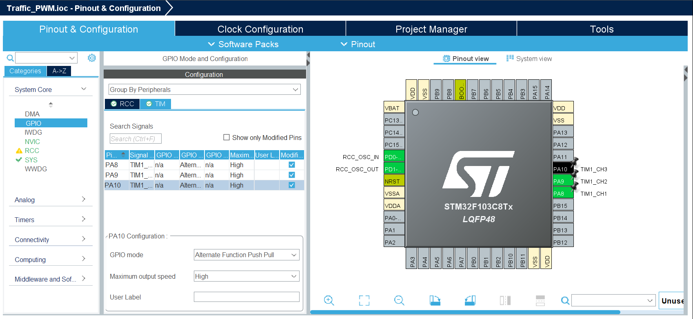
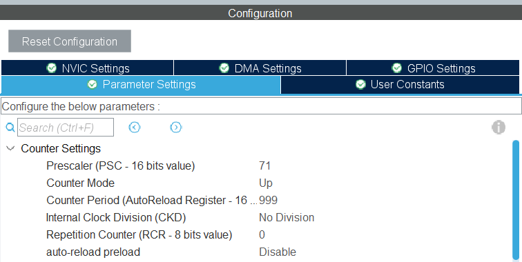

# PWM-Based Traffic Light Project

This project demonstrates how to build a traffic light system using RGB LEDs and PWM on the STM32F103C8 (Blue Pill). The purpose of the project is to understand essential STM32 concepts including PWM generation, timer configuration, GPIO mapping, and real-time behavior through timer-based state switching.

# Table of Contents

1. [Overview](#overview)
2. [Concepts Demonstrated in This Project](#concepts-demonstrated-in-this-project)
   - [PWM (Pulse Width Modulation)](#1-pwm-pulse-width-modulation)
   - [Timer Configuration (TIM1)](#2-timer-configuration-tim1)
   - [GPIO Alternate Function Mapping](#3-gpio-alternate-function-mapping)
   - [Duty Cycle Control](#4-duty-cycle-control)
   - [Timer-Based State Machine](#5-timer-based-state-machine-traffic-light-logic)
3. [PWM Configuration Summary](#pwm-configuration-summary-cubemx)
4. [Firmware Steps](#firmware-steps)
   - [Initialize TIM1 and GPIO](#1-initialize-tim1-and-gpio)
   - [Start PWM Outputs](#2-start-pwm-outputs)
   - [Update LED Intensity](#3-update-led-intensity)
5. [Hardware Connections](#hardware-connections)
6. [Required Parts](#required-parts)
7. [Complete PWM Code Example](#complete-pwm-code-runtime-duty-cycle-update)
8. [Notes and Best Practices](#notes-and-best-practices)
9. [References](#references)

---

## Overview

The design uses a Common-Anode RGB LED controlled by three PWM channels generated from TIM1. Each color (Red, Green, Blue) is driven independently using a dedicated timer channel:

- TIM1_CH1 → PA8
- TIM1_CH2 → PA9
- TIM1_CH3 → PA10

By adjusting the duty cycle on each channel, different brightness levels and LED states are achieved to simulate real traffic-light behavior.

---

## Concepts Demonstrated in This Project

### 1. PWM (Pulse Width Modulation)

PWM is used to control the average power delivered to the LED channels. The ON/OFF ratio (duty cycle) determines LED brightness. The timer switches the signal fast enough so the human eye perceives a smooth brightness level.

Core terms:

- Duty Cycle
- PWM Frequency
- ARR (Auto-Reload Register)
- CCRx (Compare Register for each channel)

### 2. Timer Configuration (TIM1)

TIM1 is an Advanced Timer on the STM32F103 capable of producing high-resolution PWM signals. In this project:

- System Clock: 72 MHz
- Prescaler: 71 → Timer clock = 1 MHz
- ARR = 999 → 1000 counts resolution
- PWM Frequency = 1 kHz

### 3. GPIO Alternate Function Mapping

The timer channels are routed to specific pins through GPIO alternate-function configuration. Using CubeMX, each channel is mapped to:

- PA8 → TIM1_CH1
- PA9 → TIM1_CH2
- PA10 → TIM1_CH3

Pins are configured as:

- Mode: Alternate Function Push-Pull
- Speed: Low or Medium



### 4. Duty Cycle Control

The LED brightness is controlled by modifying the corresponding CCR registers:

```c
HAL_TIM_SetCompare(&htim1, TIM_CHANNEL_1, value);
```

Where `value` ranges from 0 to 999 (0% to 100%). For Common-Anode RGB LEDs: higher duty cycle → lower brightness.

### 5. Timer-Based State Machine (Traffic Light Logic)

The traffic-light behavior is implemented using timing loops or non-blocking counters. This introduces essential embedded concepts:

- State machines
- Time-based switching
- Real-time LED control

---

## PWM Configuration Summary (CubeMX)

| Parameter       | Value         | Notes                         |
| --------------- | ------------- | ----------------------------- |
| Timer           | TIM1          | Advanced timer                |
| Channel         | CH1, CH2, CH3 | Used for RGB                  |
| Prescaler       | 71            | Produces 1 MHz timer clock    |
| ARR             | 999           | 1000-step resolution          |
| PWM Frequency   | 1 kHz         | Smooth LED dimming            |
| Output Polarity | Active Low    | Required for common-anode RGB |



---

## Firmware Steps

### 1. Initialize TIM1 and GPIO

Generated automatically from CubeMX via `MX_TIM1_Init()` and `MX_GPIO_Init()`.

### 2. Start PWM outputs

```c
HAL_TIM_PWM_Start(&htim1, TIM_CHANNEL_1);
HAL_TIM_PWM_Start(&htim1, TIM_CHANNEL_2);
HAL_TIM_PWM_Start(&htim1, TIM_CHANNEL_3);
```

### 3. Update LED intensity

```c
HAL_TIM_SetCompare(&htim1, TIM_CHANNEL_1, duty);  // Red
HAL_TIM_SetCompare(&htim1, TIM_CHANNEL_2, duty);  // Green
HAL_TIM_SetCompare(&htim1, TIM_CHANNEL_3, duty);  // Blue
```

---

## Hardware Connections

- Common anode → +5V or +3.3V
- R, G, B cathodes → PA8, PA9, PA10 each through a resistor (220–330 Ω)
- Ground shared between STM32 and LED supply

---

## Required Parts

To implement this project, you will need the following hardware components:

- **Microcontroller:** STM32F103C8T6 (Blue Pill)
- **Programmer/Debugger:** ST-Link V2
- **LED:** RGB LED (Common Cathode or Common Anode)
- **Resistors:** Current limiting resistors (e.g., $150 \Omega$ to $330 \Omega$ for 3.3V operation)
- **Wiring:** Breadboard and jumper wires

---

## Complete PWM Code (Runtime Duty Cycle Update)

The following example shows how to gradually change the PWM duty cycle from 0% to 100% on **Channel 1 (PA8)** at runtime. This creates a "fading" effect.

> **Note:** The example below uses a Duty Cycle range of 0 to 99, assuming the Timer's **Counter Period (ARR)** is also 99 or a similar lower value for simplicity in the tutorial. For your project where ARR is 999, you should change the loop range to $0$ to $999$.

```c
int main(void)
{
  HAL_Init();
  SystemClock_Config(); // System clock setup
  MX_GPIO_Init();        // GPIO init
  MX_TIM1_Init();        // Timer1 init with PWM

  // Start PWM on Channel 1 (PA8)
  HAL_TIM_PWM_Start(&htim1, TIM_CHANNEL_1);

  while (1)
  {
    /* Example: Update duty cycle dynamically (Fading Up) */
    for (int duty = 0; duty <= 99; duty += 10)
    {
      // Set the new compare value (duty cycle)
      __HAL_TIM_SET_COMPARE(&htim1, TIM_CHANNEL_1, duty);
      // TIM1->CCR1 = duty; is the direct register access equivalent

      HAL_Delay(500);  // Wait 500ms before changing duty cycle
    }

    // Optional: Add a fading down loop here if needed (e.g., from 99 down to 0)

  }
}
```

---

## Notes and Best Practices

- Use a resistor per LED channel.
- For common-anode LEDs, invert PWM polarity (active low).
- Avoid blocking delays in advanced applications; prefer non-blocking timers.
- For smooth color transitions, sweep CCR values or interpolate in software.

---

# References

[STM32 PWM Timer Example - DeepBlueEmbedded](https://deepbluembedded.com/stm32-pwm-example-timer-pwm-mode-tutorial/)

[PWM in STM32 - ControllersTech](https://controllerstech.com/pwm-in-stm32/)
